# Tú pagas mi cerveza

## Vulnerabilidades en sistemas de pago Cashless

## Intro

En este artículo contaré mi experiencia jugando con pulseras de un sistema Cashless de los que nos podemos encontrar en eventos como festivales, en los que tanto la entrada como todos los pagos dentro del recinto se gestionan con esta pulsera[^1]. La integridad del saldo que "depositamos" en el dispositivo (en realidad en todo un sistema) depende de su seguridad, y no siempre es perfecta…

  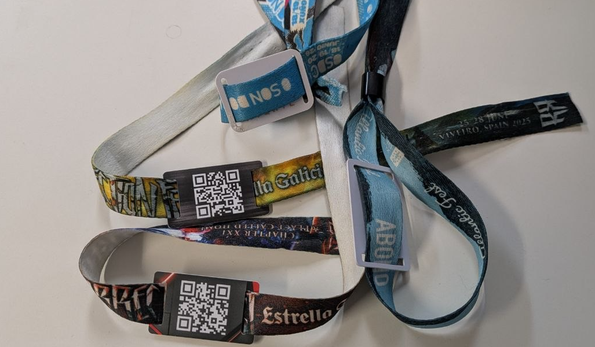

<small><em>Fig. 1: Pulsera tipo Cashless utilizada en festivales para entradas y pagos.</em></small>

Tengo que dejar claro desde el principio que yo no soy un súper experto en tecnologías RFID (Identificación por Radiofrecuencia), pero desde hace muchos años he sentido interés por ellas y siempre que ha caído en mis manos una tarjeta o pulsera he tratado de analizarla y entender cómo funciona el sistema. También quiero dejar claro que a lo largo del artículo intentaré no entrar en detalles técnicos salvo cuando sea completamente necesario.

Resumiendo muchísimo, una tarjeta RFID es un dispositivo que contiene información y que puede ser leída (y escrita, en algunos casos) sin contacto, ya sean unos pocos centímetros o unos pocos metros, en función de la tecnología empleada. Ejemplos pueden ser desde la "llave" sin contacto que muchos edificios tienen hoy en día para abrir la puerta del portal o del garaje (la acercas al lector y este se abre) a las etiquetas de los artículos de Decathlon, cuyas cajas detectan la presencia y cantidad de los artículos sólo con depositarlos en un espacio concreto donde se encuentran las antenas.

  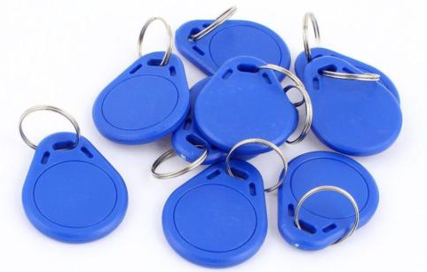

<small><em>Fig. 2: Ejemplos de dispositivos RFID: desde llaves de garaje hasta etiquetas de tiendas.</em></small>

En el pasado he estudiado alguna tarjeta de pago de sistemas de vending. Se trataba de sistemas de monedero offline, esto es, el saldo se encontraba almacenado en la tarjeta y toda la seguridad recaía en la seguridad de la propia tarjeta y en mecanismos implementados para darle más integridad al contenido de la misma. En general solían ser bastante pirateables. Las que cayeron en mis manos usaban tecnología Mifare Classic, un estándar que emplea un cifrado proprietary llamado Crypto1 para proteger la comunicación entre tarjeta y lector. Esta tecnología es bien conocida por varios fallos de seguridad[^ref1] y ataques prácticos que permiten explotarlos para acceder a todo el contenido de la tarjeta y manipularlo pese a estar protegidos por contraseña. A partir de ahí sólo había que encontrar dónde se almacenaba el saldo, en qué formato y qué funciones de checksum las máquinas usaban para comprobar que el contenido no se había manipulado. Nada que unas cuantas tardes de trabajo no solucionasen.

El sistema de pago que vamos a analizar aquí es un sistema online, donde existe una infraestructura (servidor o en la nube) que centraliza los saldos y la información de las transacciones realizadas. Los lectores con los que cuentan tanto en los puntos de recarga como en los lugares donde se efectúan cobros, están conectados con esta infraestructura (la cual podemos ver como un servidor central, para simplificar).

## La historia

Esta historia comienza en 2024 cuando, después del Resurrection Fest se me ocurre echar un ojo a la pulsera Cashless y ver qué tecnología utiliza. Me encuentro con que los lectores que tengo la identifican como Mifare Classic, toda una sorpresa, pues es el mismo tipo de chip que se usaba en las máquinas de vending que he comentado, allá por 2009-2010.

El siguiente paso estaba claro, intentar leerla. Lógicamente la tarjeta tenía algún bloque de memoria protegido por contraseña, así que lanzo los ataques conocidos a este tipo de tarjetas, pero todos fallan. Bien, me dije, habrán corregido los fallos y ahora se fabrican dispositivos con esta tecnología pero seguros. Ya lo investigaré cuando tenga tiempo y ganas…

Pasan unos meses y, por casualidad, cae en mis manos una pulsera de otro festival, O Son do Camiño. La dejo en mi escritorio y unos días después me dispongo a estudiarla. Me sorprende encontrarme de nuevo con una Mifare Classic que resiste a los ataques conocidos y encontrarme con el mismo mensaje que ya había visto con la pulsera del Resurrection: "encrypted static nonce".

Ahora sí, me ha picado la curiosidad, toca investigar y ponerse al día.

Resumiendo mucho, una empresa China había comenzado a comercializar unos chips compatibles con Mifare Classic pero "mejorados", en los que habían resuelto presuntamente todos los fallos que las hacían tan vulnerables a ataques y que prometían ser seguras. Pero como siempre, no hay que quedarse con la teoría y lo superficial, así que buceando un poco en la literatura me encuentro con las primeras revisiones de un paper[^ref2] muy reciente en que el autor afirmaba haber descubierto una puerta trasera en estos nuevos chips y estaba desarrollando ataques prácticos contra ellos.

El hardware que estaba usando para su estudio era el archiconocido (en el mundillo hacker) Proxmark3, la navaja suiza del RFID, y yo tenía uno, así que… ¿por qué no probar?

Después de múltiples pruebas los resultados no llegaban, así que decidí ponerme en contacto con Philippe Teuwen, el autor del paper, con el que descubrí que "casualmente" compartíamos canales de Discord dedicados a ciberseguridad. Una tarde de domingo conectados, él desde Bélgica y yo en España, haciendo pruebas y más pruebas y finalmente mi pulsera sirvió para que Philippe incorporase a su estudio una nueva variante de chip, también susceptible de los ataques que estaba perfeccionando. Con sus técnicas podíamos obtener todas las claves de la tarjeta, lo que permitía leer y escribir la totalidad de su contenido (excepto escribir el identificador único, ya hablaré de él más adelante) con el Proxmark. Perfecto, yo había satisfecho mi curiosidad y él incorporaría los hallazgos a la próxima revisión de su paper, en la que prometía mencionar mi colaboración.

  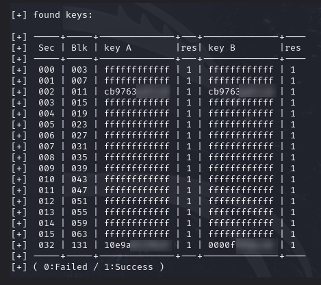

<small><em>Fig. 3: Colaboración con Philippe Teuwen, autor del paper sobre vulnerabilidades en chips Mifare Classic mejorados.</em></small>

Ahí quedó la cosa hasta que unos meses después, cuando me disponía a comprar las entradas para el Resurrection 2025, vino a mi memoria toda esta historia y la conexión de la tecnología de ambas pulseras, asi que me propuse comprobar la pulsera de 2024, con las nuevas técnicas descubiertas (que no estaban disponibles durante la celebración de esa edición).

Efectivamente, la pulsera era vulnerable y pude obtener las claves y leer todo el contenido. Pues habrá que ver si las de este año (por aquel 2025) siguen siendo vulnerables.

Aquí tengo que hacer una pausa para explicar qué implicaciones tiene esto.

Como he comentado, los sistemas de pago Cashless que he analizado en la actualidad (lo cual no quiere decir que todos sean así) son online y esto permite, por ejemplo, que desde la web de tu banco o del propio festival puedas hacer una recarga de saldo sin tener que usar físicamente la pulsera.

Puede parecer que esto hace el sistema mucho más seguro que un sistema offline, y en general así lo es, pero también tiene un problema, y es que si soy capaz de hacer una copia idéntica de tu pulsera y la uso antes que tú desde el momento en que la leo, gastaré tu saldo y probablemente anularé tu pulsera porque los datos modificados en la última transacción no estarán reflejados en tu pulsera.

## El plan

Así las cosas, llegada la fecha del festival de 2025, me llevé conmigo "un par" de aparatejos para ver si podía hacer pruebas in situ y validar mis hipótesis.

  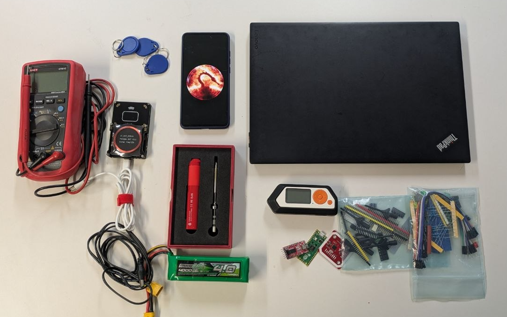

<small><em>Fig. 4: El equipo de trabajo preparado para las pruebas in situ en el Resurrection Fest 2025.</em></small>

El plan estaba más o menos claro, seguiría los siguientes pasos hasta encontrarme con que alguna de mis hipótesis fallaba y ahí se quedaría la cosa.

1. Verificar si seguían utilizando la misma tecnología.
2. Verificar si seguía siendo vulnerable a los nuevos ataques descubiertos.
3. Conseguir todas las claves y verificar que puedo leer el contenido completo.
4. Comprobar si todas las pulseras comparten las claves.
5. Comprobar si puedo clonar una pulsera (UID + todos los bloques).
6. Comprobar que, a efectos de lo que un lector Android ve, el clon y la tarjeta son indistinguibles.
7. Plantear un ataque práctico.

### 1.- Verificar si seguían utilizando la misma tecnología

El paso más sencillo a priori: Utilizar mi teléfono Android con la aplicación NFC Tools. Esta permite utilizar el lector NFC del teléfono para identificar chips RFID.

Pues la primera en la frente, mi teléfono detecta una tarjeta que no puede identificar y me da datos inconsistentes. Pues sí que se han tomado en serio la seguridad, no utilizan un tipo de tarjeta conocido… Pues nada, a disfrutar de los conciertos que, en realidad, a eso había ido.

No, esto no acaba aquí como os imaginareis. Varias horas después recordé que, tras el olvido del año anterior de mi DNI y el consiguiente bochorno para identificarme con unas fotos del mismo que rescaté de un mensaje de Whatsapp, este año me había asegurado de llevarlo conmigo. Sí, exactamente entre el teléfono y su funda es donde lo había guardado, impidiendo que el lector NFC del móvil pudiese leer la tarjeta.

Una vez subsanado el error, vuelvo a comprobar y sí, la tecnología identificada era la mil veces mencionada en este artículo Mifare Classic.

### 2 y 3.- Verificar si seguía siendo vulnerable y atacar para conseguir las claves

Otro paso sencillo, aunque un poco incómodo, hay que posicionar la pulsera sobre el lector y mantenerla hasta que termine el proceso.

  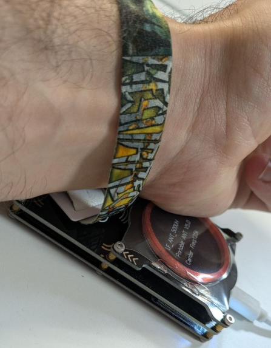

<small><em>Fig. 5: Ataque activo con Proxmark3 para la extracción de claves de la pulsera Mifare Classic.</em></small>

15 minutos de reflexión mientras los scripts de Philippe hacen su trabajo y listo. Todas las claves extraídas y contenido completo de la pulsera leído.

### 4.- Comprobar si las pulseras comparten las claves

Por cuestiones prácticas creo un diccionario de claves en mi teléfono en la aplicación Mifare Classic Tool y compruebo que puedo leer mi pulsera de forma cómoda y rápida. Así es, así que hago la misma comprobación en otra pulsera, previa solicitud de permiso a su dueño.

Comprobado, ambas pulseras se pueden leer en apenas 1 segundo con un teléfono Android una vez se han introducido las claves en el diccionario de la aplicación.

Ya que tengo esto listo el día 2 de festival, aprovecho para leer mi pulsera tras cada recarga de saldo y cada gasto para tener datos por si después los quiero analizar.

### 5 y 6.- Comprobar si puedo clonar la tarjeta

Uno de los mecanismos de seguridad con que cuentan, en la teoría, estas tarjetas es que cada una tiene un identificador único. Esto es, un código hexadecimal de 14 dígitos (7 bytes) que nunca se repite, cada pulsera, tarjeta, chip, tiene el suyo grabado de fábrica y, en el caso de las tarjetas estándar, no se puede modificar con ningún tipo de dispositivo.

Esto lo utilizan, por ejemplo, los sistemas de apertura de portales de muchos edificios o sistemas de control de acceso de gimnasios. Simplemente tienen una serie de IDs dados de alta que reconocen como llaves legítimas y es lo único que comprueban. Leyendo ese ID y posteriormente emulando la tarjeta con un teléfono con NFC o con un Flipper Zero, por ejemplo, se puede abrir dicho portal o acceder al recinto con sólo haber tenido acceso a una llave legítima durante un par de segundos.

Además existen lo que se conocen como Magic Cards, tarjetas vírgenes a las que se les puede grabar el ID que quieras, y modificarlo las veces que quieras. No son tarjetas originales y no cumplen el estándar en ese sentido, pero funcionan y la mayoría de los lectores no pueden diferenciarlas de una tarjeta legítima.

  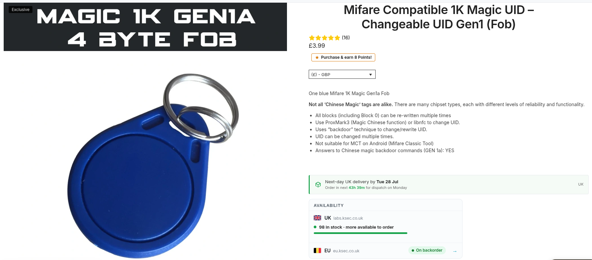

<small><em>Fig. 6: Magic Card listada junto a una pulsera original. Permite grabar cualquier UID de forma reescribible.</em></small>

Así, grabo el contenido de mi pulsera en una Magic Card, incluído el ID, hago una lectura completa con el teléfono, le pido a la aplicación que compare ambas lecturas y, como era de esperar, son idénticas.

Como intentar pagar una cerveza con un llavero RFID en lugar de con la pulsera no acabaría bien, hago la prueba con el sistema de taquillas desatendido que hay en el recinto. La máquina lee el llavero como si de una pulsera legítima se tratase.

### 7.- Plantear ataque práctico

Hasta aquí bien, queda demostrado que el sistema es vulnerable y que se puede clonar una pulsera y emplear este clon como si de la pulsera original se tratase (salvo por su aspecto físico). Pero… ¿es esta vulnerabilidad explotable en la práctica?

Para que sea así necesitaríamos:

- Poder leer una pulsera de forma rápida y sin que la víctima se entere. Si puede ser de forma masiva y desatendida, mejor.
- Clonar la pulsera objetivo en un dispositivo que mantenga el aspecto de una pulsera legítima.

Como acercar un teléfono, un Flipper o un Proxmark a la muñeca de un desconocido podría resultar un poco sospechoso, vamos a diseñar una prueba de concepto de algo un poco más discreto.

  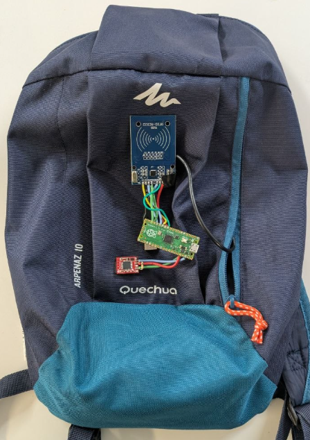

<small><em>Fig. 7: Lector RFID autónomo con microprocesador y tarjeta SD para lectura desatendida de credenciales.</em></small>

El dispositivo de la imagen no es más que un lector RFID, una placa con un microprocesador que intenta de forma contínua la lectura de una pulsera con las claves que hemos obtenido en pasos anteriores y que almacena el contenido de cada pulsera que lee en una tarjeta SD.

Así, con acercar a 2-3 centímetros la zona de la mochila donde se encuentra el lector a la pulsera de cualquiera, el contenido completo (en realidad lo he simplificado y sólo leo los dos sectores de memoria que he comprobado que se utilizan) de ésta queda almacenado en la tarjeta SD.

Con esto, la primera parte queda resuelta. Nadie sospecharía en un recinto con 30.000 o 40.000 personas de alguien que, en la multitud, roza con su mochila su muñeca. Como el dispositivo hace lecturas contínuas, el sistema permite robar credenciales de forma más o menos masiva sin intervención, más allá de portar la mochila.

  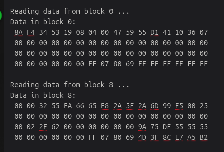

<small><em>Fig. 8: Prueba de campo entre compañeros de festival confirmando la lectura oculta a distancia de contacto.</em></small>

Una breve prueba con mis compañeros de festival demuestra su efectividad.

Segunda parte, modificar una pulsera legítima para que mantenga su aspecto pero que nos permita clonar la de una potencial víctima.

La forma más fácil que se me ocurre es anular el chip de la tarjeta original, ya sea mediante un pulso electromagnético (método no invasivo) o mediante un microcorte en la antena interna de la pulsera (método invasivo) y pegar en su parte trasera una Magic Card u ocultarla en las cercanías de algún modo.

  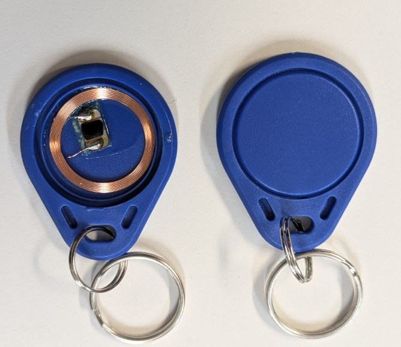

<small><em>Fig. 9: Pulsera original junto a los componentes de la Magic Card que serán integrados en ella.</em></small>

Las Magic Card de que dispongo son un poco aparatosas, así que lo suyo es desmontarla y aislar el chip y la antena para poder hacer algo discreto.

  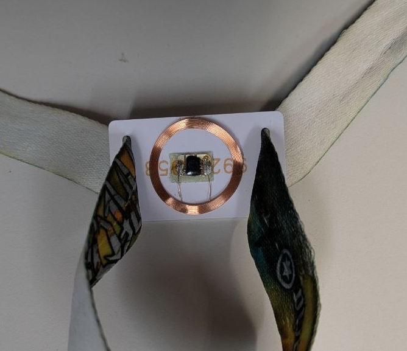

<small><em>Fig. 10: Magic Card desmontada: chip y antena enrollada listos para ser trasplantados a la pulsera.</em></small>

Este sería el aspecto del conjunto, la nueva antena y el chip quedarían en la parte trasera de la pulsera ocultos por la banda de tela. La solución parece válida, pero…

Tras darle unas cuantas vueltas, me decido por una aproximación un poco más difícil, y la resumo brevemente:

La idea es hacer dos microcortes por la parte trasera de la pulsera desconectando el chip de su antena, soldar el chip de una Magic Card a la antena de la propia pulsera original, haciendo así el dispositivo resultante todavía más discreto y compacto.

  

<small><em>Fig. 11: Inspección de la pulsera con luz intensa para localizar las pistas de conexión chip-antena.</em></small>

Para esto hay que inspeccionar la pulsera, y a falta de rayos X buena es una luz potente para poder ver las tripas del dispositivo.

Marco las conexiones entre el chip y la antena, realizo unos pequeños y precisos cortes, y sueldo el chip de la Magic Card a la antena original de la pulsera.

  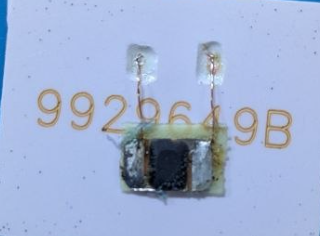

<small><em>Fig. 12: Esquema de los microcortes necesarios para desconectar el chip original de su antena.</em></small>

Realizo las pruebas oportunas para ver que la pulsera modificada, además de mantener su aspecto original, tiene todas las funcionalidades de una Magic Card.

Y con esto queda demostrado que la explotación real y práctica de la vulnerabilidad es posible. Tenemos una pulsera original, con su chip original anulado y un nuevo chip que podemos modificar para que se haga pasar por otra pulsera, y así poder gastar el saldo de la pulsera clonada.

El flujo seguido por los ciberdelincuentes podría ser algo como sigue:

  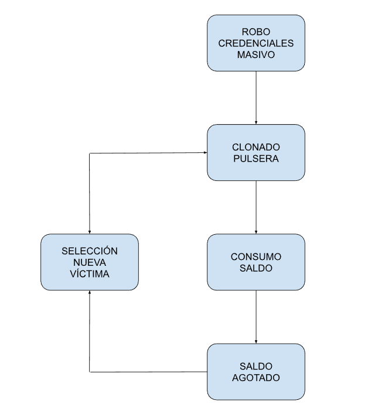

<small><em>Fig. 13: Diagrama del flujo de ataque: robo masivo de credenciales, clonado, consumo de saldo y selección de nueva víctima.</em></small>

Con toda esta información escribo un informe y se lo envío al INCIBE para que contacten con la empresa que provee el sistema y que puedan solucionar las vulnerabilidades.

Casi un año después, y justo después de la edición 2026 del festival, la información sobre la vulnerabilidad ha sido publicada[^ref3] y presuntamente corregida.

No voy a hacer ni cálculos ni especulaciones sobre el potencial impacto de esta vulnerabilidad y su "sencilla" explotación, pero teniendo en cuenta que pasan por el recinto durante los 4 días de duración de este evento unas 140.000 personas y que todos los pagos que se hacen en él (bebida, comida, merchandising) se hacen imperativamente con la pulsera, no es difícil darse cuenta de las cifras del dinero que se mueve son astronómicas.

Ahora la pregunta es… ¿Qué pasa con los sistemas Cashless de otros festivales y eventos?

He conseguido algunas pulseras de otros festivales y las analizaré. Eso, y cómo funciona y cómo de seguro es el sistema de devolución del saldo restante al finalizar el festival lo vamos a dejar para el segundo capítulo sobre este tema.

---

*Disclaimer: Los comandos exactos empleados para la obtención de claves, así como el esquema y código fuente del sistema de robo de credenciales no los he publicado por una cuestión de responsabilidad, pero pueden ser proporcionados para otras investigaciones y trabajos que lo justifiquen.*

[^ref1]: https://eprint.iacr.org/2009/137.pdf
[^ref2]: https://eprint.iacr.org/2024/1275.pdf
[^ref3]: https://www.cve.org/CVERecord?id=CVE-2026-4648
